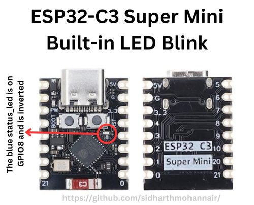

# Blink Project

This Arduino project demonstrates how to blink an LED using the ESP32-C3 super tiny module. The LED will turn on for two seconds and then off for one second, repeatedly.

## Schematic

The LED is connected to pin 8 as per the schematic below.



## Components

- ESP32-C3 super tiny module
- LED
- Resistor (220 ohms)
- Breadboard and jumper wires

## Code Explanation

The code initializes the built-in LED pin (pin 8) as an output and then enters a loop where the LED is turned on for two seconds and off for one second.

```cpp
#define LED_BUILTIN 8 // Internal LED pin is 8 as per schematic

// the setup function runs once when you press reset or power the board
void setup() {
  // initialize digital pin LED_BUILTIN as an output.
  pinMode(LED_BUILTIN, OUTPUT);
}

// the loop function runs over and over again forever
void loop() {
  digitalWrite(LED_BUILTIN, LOW);   // turn the LED on (LOW because the LED is inverted)
  delay(2000);                      // wait for two seconds
  digitalWrite(LED_BUILTIN, HIGH);  // turn the LED off by making the voltage HIGH
  delay(1000);                      // wait for a second
}
```

## Instructions

1. Connect the ESP32-C3 module to your computer using a USB cable.
2. Open the Arduino IDE and load the provided `blink.ino` file.
3. Ensure the correct board and port are selected in the Arduino IDE.
4. Upload the code to the ESP32-C3 module.
5. Observe the LED blinking on and off as per the code.

## Result


## Notes

- Ensure you have the ESP32 board package installed in your Arduino IDE.
- If the LED does not blink, double-check the connections and the pin number defined in the code.

