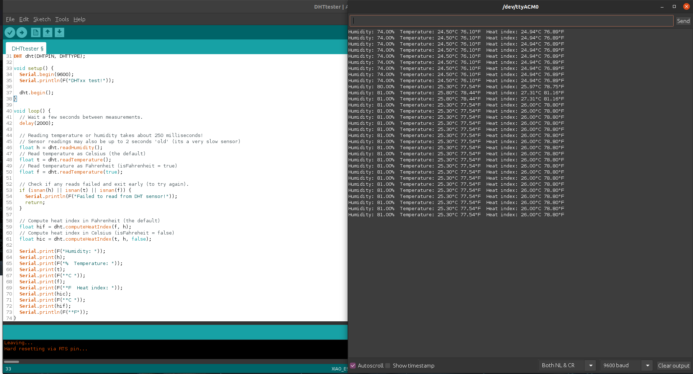
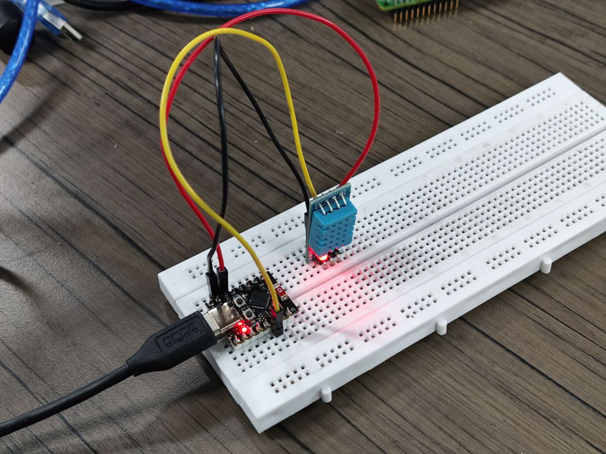

# ESP32 C3 Super Mini with DHT11

## Introduction
This project demonstrates how to use the ESP32 C3 Super Mini microcontroller with a DHT11 sensor to measure temperature and humidity. The data will be displayed via the Serial Monitor in the Arduino IDE.

## Schematic
Below is the schematic for connecting the ESP32 C3 Super Mini to the DHT11 sensor.


### Components
- ESP32 C3 Super Mini
- DHT11 Temperature and Humidity Sensor
- Jumper Wires
- Breadboard
- 10K Resistor

## Code Explanation
The provided code reads the temperature and humidity data from the DHT11 sensor and prints it to the Serial Monitor. It also calculates the heat index, which is a measure of how hot it feels when relative humidity is factored in with the actual air temperature.

```cpp
#include "DHT.h"

#define DHTPIN 10     // Digital pin connected to the DHT sensor
#define DHTTYPE DHT11 // DHT 11

DHT dht(DHTPIN, DHTTYPE);

void setup() {
  Serial.begin(9600);
  Serial.println(F("DHTxx test!"));
  dht.begin();
}

void loop() {
  delay(2000);
  float h = dht.readHumidity();
  float t = dht.readTemperature();
  float f = dht.readTemperature(true);

  if (isnan(h) || isnan(t) || isnan(f)) {
    Serial.println(F("Failed to read from DHT sensor!"));
    return;
  }

  float hif = dht.computeHeatIndex(f, h);
  float hic = dht.computeHeatIndex(t, h, false);

  Serial.print(F("Humidity: "));
  Serial.print(h);
  Serial.print(F("%  Temperature: "));
  Serial.print(t);
  Serial.print(F("°C "));
  Serial.print(f);
  Serial.print(F("°F  Heat index: "));
  Serial.print(hic);
  Serial.print(F("°C "));
  Serial.print(hif);
  Serial.println(F("°F"));
}
```

### Instructions
1. **Set Up**:
   - Install the necessary Arduino libraries:
     - [DHT Sensor Library](https://github.com/adafruit/DHT-sensor-library)
     - [Adafruit Unified Sensor Library](https://github.com/adafruit/Adafruit_Sensor)
   - Connect the DHT11 sensor to the ESP32 C3 Super Mini as per the schematic.

2. **Upload Code**:
   - Open the Arduino IDE.
   - Copy the provided code into the Arduino IDE.
   - Select the appropriate board and port in the Arduino IDE.
   - Upload the code to the ESP32 C3 Super Mini.

3. **View Results**:
   - Open the Serial Monitor in the Arduino IDE.
   - Set the baud rate to 9600.
   - Observe the temperature and humidity readings along with the calculated heat index.

## Result
Once the code is uploaded and the ESP32 C3 is running, the Serial Monitor will display the temperature, humidity, and heat index values.





## Additional Notes
- Ensure that the DHT11 sensor is properly connected and powered.
- If using a 3.3V logic board, connect the sensor's VCC pin to 3.3V instead of 5V.
- Use a 10K resistor between the data pin and VCC for stable readings.

## Resources
- [DHT Sensor Library](https://github.com/adafruit/DHT-sensor-library)
- [Adafruit Unified Sensor Library](https://github.com/adafruit/Adafruit_Sensor)
