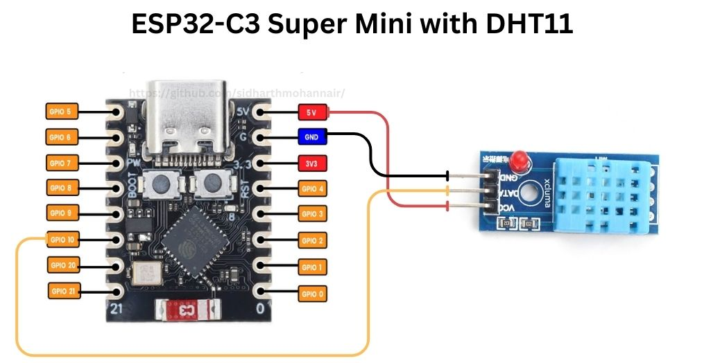
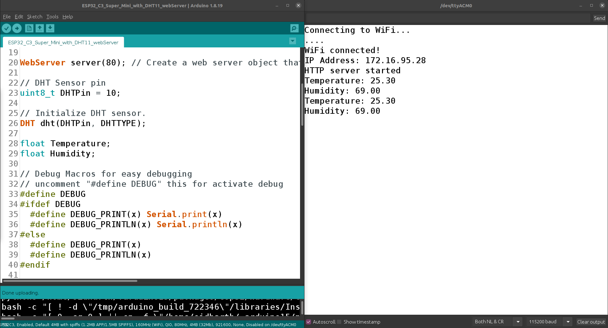
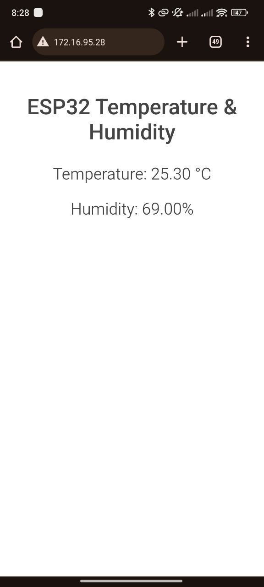

# ESP32-C3 Super Mini with DHT11/DHT22 - Display Values Using Web Server

## Introduction
This project involves setting up an ESP32-C3 microcontroller to read temperature and humidity data from a DHT11/DHT22 sensor and display these values on a web server. The project is designed to provide a simple yet effective solution for monitoring environmental conditions remotely.

## Schematic
The schematic diagram shows the connections between the ESP32-C3, the DHT11/DHT22 sensor, and other necessary components.



## Components
- ESP32-C3 Super Mini
- DHT11/DHT22 Sensor
- Breadboard
- Connecting wires
- Power supply

### Specifications
- **ESP32-C3 Super Mini**: A small, powerful microcontroller with built-in Wi-Fi capabilities.
- **DHT11/DHT22 Sensor**: A sensor for measuring temperature and humidity.

## Code Explanation

### Full Code
```
You can find the full code in the repository, and you can also download the code folder for use.
```

## Flow Chart


## Code Explanation by Sections
### 1. Library Inclusions and Macros

```cpp
#include <WiFi.h>
#include <WebServer.h>
#include "DHT.h"
```

- **WiFi.h**: This library allows the ESP32 to connect to Wi-Fi networks.
- **WebServer.h**: This library is used to create a web server that can handle HTTP requests.
- **DHT.h**: This library is for interfacing with the DHT temperature and humidity sensors.

### 2. DHT Sensor Type Definition

```cpp
#define DHTTYPE DHT11   // DHT 11
//#define DHTTYPE DHT21   // DHT 21 (AM2301)
//#define DHTTYPE DHT22   // DHT 22 (AM2302), AM2321
```

- **DHTTYPE**: This macro defines the type of DHT sensor being used. Uncomment the appropriate line for the sensor type in use.

### 3. Wi-Fi Credentials

```cpp
/* Put your SSID & Password */
const char* ssid = "Your WiFi Name";       // Enter your WiFi SSID
const char* password = " Your WiFi Password";     // Enter your WiFi password
```

- **ssid**: The name of the Wi-Fi network to connect to.
- **password**: The password for the Wi-Fi network.

### 4. Web Server Object and DHT Sensor Initialization

```cpp
WebServer server(80); // Create a web server object that listens for HTTP requests on port 80
uint8_t DHTPin = 10;  // DHT Sensor pin
DHT dht(DHTPin, DHTTYPE); // Initialize DHT sensor.
```

- **server**: The web server object listens on port 80.
- **DHTPin**: The GPIO pin number to which the DHT sensor is connected.
- **dht**: An instance of the DHT sensor class initialized with the specified pin and sensor type.

### 5. Debug Macros

```cpp
#define DEBUG
#ifdef DEBUG
  #define DEBUG_PRINT(x) Serial.print(x)
  #define DEBUG_PRINTLN(x) Serial.println(x)
#else
  #define DEBUG_PRINT(x)
  #define DEBUG_PRINTLN(x)
#endif
```

These macros simplify debugging by conditionally enabling or disabling debug prints based on whether the DEBUG macro is defined.

### 6. Setup Function

```cpp
void setup() {
  Serial.begin(115200); // Start the Serial communication to send messages to the computer
  delay(100);

  dht.begin(); // Initialize the DHT sensor

  DEBUG_PRINTLN("Connecting to WiFi...");
  WiFi.begin(ssid, password); // Connect to Wi-Fi network

  // Wait until the device is connected to Wi-Fi
  while (WiFi.status() != WL_CONNECTED) {
    delay(1000);
    DEBUG_PRINT(".");
  }
  DEBUG_PRINTLN("
WiFi connected!");
  DEBUG_PRINT("IP Address: ");
  DEBUG_PRINTLN(WiFi.localIP()); // Print the IP address

  server.on("/", handle_OnConnect); // Define handling function for root URL
  server.onNotFound(handle_NotFound); // Define handling function for 404 (Not Found)

  server.begin(); // Start the HTTP server
  DEBUG_PRINTLN("HTTP server started");
}
```

- **Serial Communication**: Initializes serial communication for debugging purposes with a baud rate of 115200.
- **DHT Sensor Initialization**: Begins the DHT sensor.
- **WiFi Connection**: Connects to the specified Wi-Fi network and waits until the connection is established. It prints dots to the Serial Monitor while attempting to connect.
- **HTTP Server Initialization**: Sets up the web server to handle root URL ("/") and not found (404) requests, and starts the server.

### 7. Loop Function

```cpp
void loop() {
  server.handleClient(); // Handle client requests
}
```

The loop function continuously listens for client requests and handles them.

### 8. Handle Client Requests

```cpp
void handle_OnConnect() {
  Temperature = dht.readTemperature();  // Get temperature value
  Humidity = dht.readHumidity();        // Get humidity value

  // Check if any reading failed and send "N/A" if so
  if (isnan(Temperature) || isnan(Humidity)) {
    DEBUG_PRINTLN("Failed to read from DHT sensor!");
    server.send(200, "text/html", SendHTML("N/A", "N/A"));
  } else {
    DEBUG_PRINT("Temperature: ");
    DEBUG_PRINTLN(Temperature);
    DEBUG_PRINT("Humidity: ");
    DEBUG_PRINTLN(Humidity);
    server.send(200, "text/html", SendHTML(String(Temperature), String(Humidity))); // Send the HTML page with the values
  }
}

void handle_NotFound() {
  server.send(404, "text/plain", "Not found");
}
```

- **handle_OnConnect**: Reads the temperature and humidity from the DHT sensor. If the readings fail, it returns "N/A". Otherwise, it returns the actual readings.
- **handle_NotFound**: Returns a 404 error if the requested URL is not found.

### 9. HTML Generation

```cpp
String SendHTML(String Temperaturestat, String Humiditystat) {
  String ptr = "<!DOCTYPE html> <html>\n";
  ptr += "<head><meta name=\"viewport\" content=\"width=device-width, initial-scale=1.0, user-scalable=no\">\n";
  ptr += "<title>ESP32 Temperature & Humidity</title>\n";
  ptr += "<style>html { font-family: Helvetica; display: inline-block; margin: 0px auto; text-align: center;}\n";
  ptr += "body{margin-top: 50px;} h1 {color: #444444;margin: 50px auto 30px;}\n";
  ptr += "p {font-size: 24px;color: #444444;margin-bottom: 10px;}\n";
  ptr += "</style>\n";
  ptr += "</head>\n";
  ptr += "<body>\n";
  ptr += "<div id=\"webpage\">\n";
  ptr += "<h1>ESP32 Temperature & Humidity</h1>\n";

  ptr += "<p>Temperature: ";
  ptr += Temperaturestat;
  ptr += " &deg;C</p>";
  ptr += "<p>Humidity: ";
  ptr += Humiditystat;
  ptr += "%</p>";

  ptr += "</div>\n";
  ptr += "</body>\n";
  ptr += "</html>\n";
  return ptr;
}
```

- **SendHTML**: Generates and returns an HTML string that displays the temperature and humidity values.

## Instructions
### Prerequisites

- Arduino IDE
- Wi-Fi network

### Hardware Setup

- Connect the DHT11/DHT22 sensor to the ESP32-C3 according to the schematic.

### Software Setup

- Install the Arduino IDE from the official website.
- Install the required libraries (WiFi, WebServer, DHT).

### Running the Project

- Open the Arduino IDE and load the provided code.
- Upload the code to the ESP32-C3.
- Open the Serial Monitor to view the debug messages.
- Access the web server using the IP address displayed in the Serial Monitor.

## Result

When the project is running, the ESP32-C3 will display real-time temperature and humidity data from the DHT sensor on a web page accessible via the device's IP address.






## Additional Notes

- Ensure the sensor connections are secure to avoid reading errors.
- Use a stable power supply to ensure reliable operation.
- Consider using the DHT22 sensor for more accurate measurements.

## Resources

- [ESP32-C3 Datasheet](https://www.espressif.com/sites/default/files/documentation/esp32-c3_datasheet_en.pdf)
- [DHT11 & DHT22 Datasheet](https://cdn-learn.adafruit.com/downloads/pdf/dht.pdf)
- [Arduino IDE Installation Guide](https://www.arduino.cc/en/Guide/HomePage)
